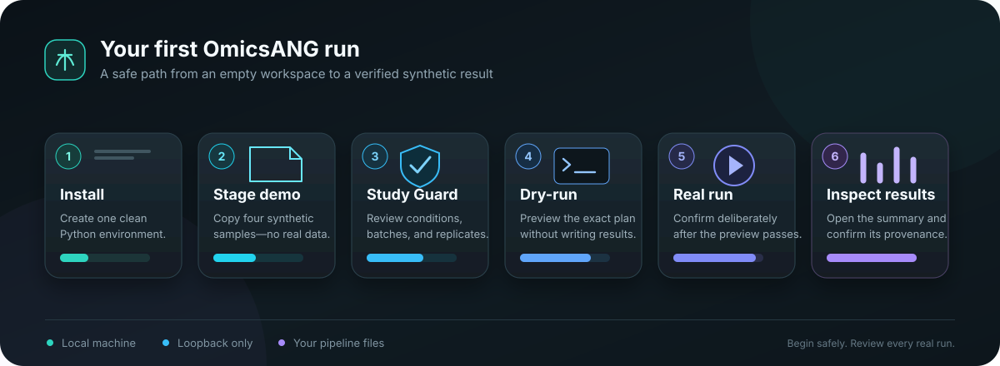

# OmicsANG

**All your omics. One workspace.**

[](https://github.com/challagandla/OmicsANG/actions/workflows/ci.yml)

OmicsANG is a local browser workspace for inspecting and operating trusted
bioinformatics pipeline repositories. It discovers pipelines beneath a root
directory and brings together Snakemake command previews and runs, study-design
checks, terminal sessions, results and QC browsing, configuration and code
editing, run records, DAG rendering, and optional command-line coding agents.



## Start here

New to OmicsANG? Follow the illustrated
[beginner tutorial](docs/BEGINNER_TUTORIAL.md) from installation through a
reviewed dry-run, a real synthetic run, result inspection, and clean shutdown.

[Beginner tutorial](docs/BEGINNER_TUTORIAL.md) ·
[Synthetic demo](examples/demo-pipeline) ·
[GitHub repository](https://github.com/challagandla/OmicsANG) ·
[Security](SECURITY.md) ·
[License](LICENSE)

OmicsANG is source-available under the PolyForm Noncommercial License 1.0.0. It
is not open-source software. This release is offered without a license fee only
for uses permitted by that license. See
[License and commercial use](#license-and-commercial-use) before using or
redistributing it.

## Trust boundary

OmicsANG is for one trusted local user working with trusted local repositories.
It is not a sandbox, remote service, multi-user service, or clinical diagnostic
system. It refuses non-loopback bind addresses and must not be exposed through a
network, reverse proxy, port-forward, or shared host.

Pipeline commands, shells, and agents execute with your OS account's permissions.
They can read or change anything that account can access. Repository output,
terminal logs, and OmicsANG state may contain genomic, clinical, personal, or
confidential information. External agents may send prompts, repository context,
selected code, and logs to their providers under your account configuration and
the provider's terms. OmicsANG has no telemetry or analytics by default.

Browse and contextual help operate locally. Package and command help statically
inspect a selected supported text file and the caret context; they do not import
or execute project modules or commands, contact a package registry, or fetch
third-party documentation. An official
documentation site is contacted only if the user explicitly opens its displayed
link. HTTP request-line logging is disabled by default because URLs used by some
legacy file surfaces can contain local names or search terms.

## Supported systems

OmicsANG currently supports Linux with Python 3.10 through 3.13. Its process
identity and terminal controls rely on Linux `/proc` and POSIX facilities, so
native Windows and macOS are not supported in this release. On Windows, use a
current WSL distribution and run both OmicsANG and the pipeline inside WSL. A
current JavaScript-enabled browser is required.

## Prerequisites

Required:

- Python 3.10, 3.11, 3.12, or 3.13;
- `venv` and `pip`, or Conda, Mamba, or Micromamba;
- a browser on the same machine;
- trusted pipeline directories that you are prepared to let OmicsANG read and,
  when you use an editor or run action, modify.

Optional tools are not bundled:

- Snakemake is required to dry-run or execute Snakemake workflows;
- Graphviz `dot` enables DAG rendering;
- Git enables repository status and worktrees;
- GitHub CLI `gh` enables read-oriented GitHub status where configured;
- Claude Code and Codex enable their corresponding agent terminals;
- Conda, Mamba, or Micromamba may be needed by pipelines that use Conda
  environments;
- NCBI SRA Toolkit `prefetch` and `fasterq-dump` are required for the optional
  public-data download and FASTQ-conversion workflow;
- `pigz` or `gzip` accelerates optional FASTQ compression; OmicsANG otherwise
  uses Python's gzip implementation;
- Slurm client commands are needed only for Slurm features.

Install optional tools from their official distributions. You are responsible
for their licenses, accounts, provider terms, and configuration. Their names are
used only to identify compatible external programs; no affiliation or
endorsement is implied. Outward Git operations such as push, pull, pull-request
creation, remote connection, and repository creation are disabled in this
release.

Check the tools you intend to use:

```bash
python3 --version
snakemake --version
dot -V
git --version
```

It is normal for an optional command to be missing if you do not need that
integration.

## Recommended installation with pip and venv

Download and extract an OmicsANG release source archive, then enter its top-level
directory. For the `0.2.1` source archive, the complete installation is:

```bash
cd omicsang-0.2.1
python3 -m venv "$HOME/.venvs/omicsang"
. "$HOME/.venvs/omicsang/bin/activate"
python -m pip install --upgrade pip
python -m pip install .
omicsang --version
```

The installed CLI and web assets no longer depend on that source directory.
Keep the virtual environment activated when using the commands in the tutorial.
If you downloaded the `0.2.1` wheel into the current directory, it can be
installed in the same environment instead:

```bash
python -m pip install ./omicsang-0.2.1-py3-none-any.whl
```

Use a fresh virtual environment for the rename. Do not install OmicsANG into an
environment that still contains the pre-rename `benchtop` distribution: both
distributions own the same `benchtop/` implementation files, and uninstalling
either one afterward can remove files needed by the other. The recommended new
environment above avoids that overlap. To reuse an old environment, remove the
old distribution first with `python -m pip uninstall benchtop`, then install
OmicsANG. If both distributions were already mixed, recreate the environment.

## Installation with Conda, Mamba, or Micromamba

The reviewed `environment.yml` uses `conda-forge` plus `nodefaults`, then
installs OmicsANG from `pyproject.toml`. From the extracted release directory,
choose exactly one of these commands:

```bash
conda env create --file environment.yml
```

```bash
mamba env create --file environment.yml
```

```bash
micromamba env create --file environment.yml
```

If the environment already exists, update it from the same directory with the
matching tool. For example:

```bash
conda env update --name omicsang --file environment.yml --prune
```

Verify and launch without relying on shell activation:

```bash
conda run --name omicsang omicsang --version
```

Replace `conda run` with `mamba run` or `micromamba run` when that is the tool
you selected. The provided `bootstrap.sh` performs the create-or-update
operation and then launches the installed CLI with the same command-line
options.

For example, this creates or updates the environment and launches the demo
workspace without opening a browser:

```bash
./bootstrap.sh --root "$HOME/omicsang-workspace" --state "$HOME/.local/state/omicsang-demo" --host 127.0.0.1 --port 8787 --no-browser
```

The environment intentionally selects conda-forge. It does not make any general
statement about Conda distribution or provider licensing.

## Tutorial: stage and dry-run the synthetic pipeline

For a complete visual walkthrough—including installation, Study Guard,
dry-run, real run, result verification, stopping, relaunching, and common
problems—use the [beginner tutorial](docs/BEGINNER_TUTORIAL.md). The concise
path below covers staging and dry-running the same fixture.

The repository includes a tiny original fixture with four synthetic samples.
It contains no biological sequences or real participant data. From the
extracted OmicsANG release directory, copy it into a dedicated pipeline root:

```bash
mkdir -p "$HOME/omicsang-workspace"
cp -R examples/demo-pipeline "$HOME/omicsang-workspace/"
```

First verify the fixture directly with Snakemake. This does not create its
declared result because `--dry-run` is present:

```bash
cd "$HOME/omicsang-workspace/demo-pipeline"
snakemake --snakefile Snakefile --configfile config/config.yaml --cores 1 --dry-run --printshellcmds
cd "$HOME"
```

Now start OmicsANG in a dedicated terminal. The root contains pipeline
directories; the state directory is private runtime state and must be outside
the pipeline root:

```bash
omicsang --root "$HOME/omicsang-workspace" --state "$HOME/.local/state/omicsang-demo" --host 127.0.0.1 --port 8787
```

OmicsANG normally sends a URL containing a one-time token in the URL fragment
directly to the registered Linux desktop browser through `/usr/bin/xdg-open` or
`/usr/bin/gio`. It does not honor the `BROWSER` environment variable, construct
a shell command, or connect the opener to OmicsANG's stdin, stdout, or stderr.
The token is therefore omitted from ordinary process and service logs. The
fragment is
captured and removed from the address bar by the first local page script, before
the vendored terminal libraries or main application execute. It is then
exchanged locally and replaced by a process-scoped browser session. A restart
creates a new URL and invalidates the old session. To prevent automatic browser
launch, add `--no-browser`; the complete one-time URL is then written directly
to the controlling terminal (`/dev/tty`), bypassing redirected stdout and
stderr:

```bash
omicsang --root "$HOME/omicsang-workspace" --state "$HOME/.local/state/omicsang-demo" --host 127.0.0.1 --port 8787 --no-browser
```

`--no-browser` intentionally refuses to start when there is no controlling
terminal. Run it in an interactive terminal and use the complete URL shown
there; this prevents a process supervisor or redirected output file from
persisting the launch capability. A terminal recorder or OS-level process
tracer can still observe a capability deliberately delivered through that
trusted local environment; do not use terminal recording for this launch.

HTTP access logging is off by default. Use `--access-log` only for deliberate
local troubleshooting; request lines may include pipeline names, file paths, or
search terms from older endpoints. The new Browse, contextual-help, and result
directory searches send private values in authenticated POST bodies instead of
placing them in URLs.

As with any desktop browser launch, the complete URL exists transiently in the
OS/browser handoff and browser process. Host audit tooling, process tracing, a
modified desktop opener, or browser-profile instrumentation can observe it.
OmicsANG's guarantee is that it does not write the capability into its own
state, application logs, shell command lines, stdout, or stderr. Run it only in
the documented trusted local-user environment.

In the browser:

1. Select `demo-pipeline` in the pipeline list.
2. Open **Run** and select `config/config.yaml`.
3. Leave the target blank, set cores to `1`, keep **dry-run** selected, and
   clear **use Conda** unless your Snakemake setup needs it.
4. Open **Study**, review the configured `data/samples.tsv`, and choose
   **Use audited study**. All names and values are synthetic; the expected
   low-replication warning is appropriate for this four-row software fixture.
5. Return to **Run**, review the generated command and RunPlan, choose
   **Dry-run**, and confirm the
   previewed command.
6. Follow the terminal until Snakemake reports that the run was a dry run.

The dry run exercises pipeline discovery, configuration selection, study
inspection, command construction, RunPlan creation, the local queue, and the
terminal without producing the fixture's result. If you later choose a real
run, review the new confirmation carefully; the fixture writes only
`results/synthetic-summary.tsv` inside its own directory.

## Working with a pipeline

OmicsANG discovers each direct child of the configured root. A Snakemake
pipeline can use `workflow/Snakefile` or `Snakefile`; common configuration files
under `config/`, test configurations, profiles, and environment metadata are
detected when present.

- **Study** inspects candidate sample sheets and highlights cohort, replicate,
  input, balance, and design findings. Review it before a real run.
- **Run** previews the exact Snakemake command and keeps dry-run as the default.
  Real local or Slurm execution has a separate confirmation.
- **Browse** lists and searches bounded, authorized pipeline directories by
  name. It opens supported text in Code and explicitly opens other small files
  through an authenticated local request.
- **DAG** uses the separately installed Graphviz `dot` executable and renders a
  non-scriptable image.
- **Results** browses recognized output and QC files within authorized pipeline
  roots. User-controlled HTML and SVG are downloaded rather than executed in
  OmicsANG's browser origin.
- **Config** and **Code** edit supported text files under the selected pipeline.
  Saves are atomic; private backups and trash are kept under the state directory,
  not beside repository files.
- **Help** explains the active tab's purpose, prerequisites, reads, writes,
  network activity, persistence, cautions, and shortcuts. Code adds local,
  package-aware help for the selected saved file.
- **Capsules** and run history compare recorded execution context and outputs.
- **Public data** searches NCBI SRA/GEO through the NCBI E-utilities HTTPS
  service. Search terms, database choices, and accession identifiers are sent
  to NCBI; downloads launched with SRA Toolkit follow that tool's network,
  account, and retention behavior. Do not submit confidential identifiers as
  search terms.
- **Terminal** sessions remain powerful local processes running as your OS user.

The CLI options take precedence over defaults. Equivalent environment variables
are useful for a dedicated launcher:

```bash
export OMICSANG_ROOT="$HOME/omicsang-workspace"
export OMICSANG_STATE="$HOME/.local/state/omicsang-demo"
export OMICSANG_HOST="127.0.0.1"
export OMICSANG_PORT="8787"
export OMICSANG_LOG_RETENTION_DAYS="30"
export OMICSANG_MAX_LOCAL_CORES="8"
omicsang
```

`OMICSANG_RESULTS_ROOTS` may contain an `os.pathsep`-separated list of additional
result roots that you explicitly authorize. Keep it as narrow as possible. The
default is the configured pipeline root.

## Compatibility with the legacy command and state

`omicsang` is the primary command and `omicsang` is the installed distribution
name. The `benchtop` command and `benchtop` Python implementation package remain
available since `0.1.1` for compatibility with existing launchers and imports. New
installations and documentation should use `omicsang`.

Command and import compatibility does not make the pre-rename `benchtop`
distribution safe to co-install. Use a clean virtual environment, or uninstall
that distribution before installing OmicsANG, as described in the installation
warning above. If both distributions have already shared one environment,
recreate it instead of uninstalling either package in place.

Use the `OMICSANG_*` environment variables for new configuration. The
corresponding legacy `BENCHTOP_*` variable is consulted only when the OmicsANG
name is absent. Setting both names to the same value is accepted; setting them
to different values is rejected so the selected root, state, bind, retention,
or resource limit is never ambiguous. Explicit `--root` and `--state` options
take precedence over either environment-variable form.

Without an explicit state setting, OmicsANG uses `$XDG_STATE_HOME`, or
`$HOME/.local/state` when `XDG_STATE_HOME` is unset. A clean installation creates
and uses its `omicsang` child directory. If only the legacy `benchtop` child
already exists, OmicsANG reuses it so upgrades retain existing state. If only
`omicsang` exists, it is used. If both directories exist, startup stops and asks
you to choose explicitly with `--state` or `OMICSANG_STATE`; it never merges or
silently chooses between them.

## Navigation, Browse, and contextual help

Use **Find pipeline** to filter the registered pipeline list by name or path.
The filter runs in the browser and is not saved. Workspace tabs support
Left/Right and Home/End while focused; `Ctrl-PageUp` and `Ctrl-PageDown` cycle
all views. The Back, Forward, and Recent controls restore OmicsANG views without
putting pipeline names, paths, searches, code, or package names in the address
bar or browser history state. Recent-view context remains in process memory.
Less frequently used views move into **More** as the window narrows.

The contextual **Help for ...** control is available beside every active view;
the top-bar **Help** button opens the same keyboard-accessible drawer. Help text
is bundled with OmicsANG. It does not contact an online help service.

Browse lists immediate children or performs a bounded name search beneath the
current directory. It does not search file contents. Hidden entries, symlinks,
special files, protected workspace directories, and unsafe hard links are
omitted. When bounds are reached, the UI labels the response as partial instead
of implying a complete search. Search terms and relative paths are sent only in
authenticated local POST bodies. Editable text opens in Code; other regular
files up to 32 MiB can be opened through the same capped POST flow. Larger files
remain metadata-only in Browse and should be handled with an appropriate local
tool or an authorized Results workflow.

In Code, **Tool & package help** statically recognizes supported import,
manifest, workflow, shell-tool, and environment declarations. With the caret on
a supported command, option, or option value, press `F1` to open a matching
parameter card and the searchable complete catalog snapshot. The first detailed
catalog covers all 24 long options accepted by the FastQC 0.12.1 launcher,
including short aliases and explicit resource cautions for `--threads` and
`--memory`. Caret matching uses unsaved editor text; package detection is clearly
labelled as a saved-file snapshot and refreshes after save or reload.

Command matching is intentionally heuristic for common shell and Snakemake
forms, and a catalog is version-labelled rather than assumed to match the active
environment. Detection never imports a project module or runs a discovered
command. Unknown packages receive no guessed documentation or license claim.
Curated official documentation links show their exact destination domain, use
HTTPS, and open only after a user click. No source text, command, or package name
is sent to a registry or help service.

Code saves carry the revision returned by the last read. If another editor,
agent, or Git operation changes or removes the file, OmicsANG stops the save and
offers reload, compare, save-as, or a separately confirmed one-time overwrite;
it does not silently replace the external change.

## Agents

The Agents view can launch an installed `claude` or `codex` CLI in a selected
trusted repository or an OmicsANG-created Git worktree. The shell option opens
your configured shell. Agent and fleet launches require an explicit
acknowledgement in the UI.

Pipeline-specific unattended agent execution is not enabled in this release.
Agents remain explicitly approved interactive tools; Git worktrees separate
changes but do not provide resource, network, or filesystem containment.

Before confirming an agent launch, inspect the selected repository or worktree
and every context category named by the confirmation. Preview depth varies by
surface: run debugging shows its structured prompt material, Fleet shows a
possibly truncated task preview, and Code Assistant summarizes the included
context categories. **Copy prompt** exports the exact generated prompt for Code
Assistant's **Review** action; its other actions provide only the context
summary before launch. A repository-root agent starts an interactive CLI and
therefore has no complete pre-launch transcript to preview.

These confirmations are scope warnings, not a data-loss-prevention boundary.
An external agent may transmit supplied material or files it reads to its
provider. Agent CLIs and shells are not isolated by OmicsANG and run with your OS
account's full permissions. Do not launch them on data or repositories that the
provider must not receive or that you do not trust them to modify.

OmicsANG keeps agent-terminal prompts and output only in the running process's
bounded in-memory scrollback; it does not create durable terminal log files for
agent sessions. Closing a browser tab does not stop the agent, and its in-memory
output remains available only while that OmicsANG process and session remain
alive, then is cleared. Fleet retains a one-way prompt digest and byte count,
not another raw prompt copy.

Agent children receive a minimal environment: runtime/locale/proxy and
certificate settings plus only the selected Claude or Codex provider's explicit
configuration and credential variables. Unrelated server secrets, GitHub
tokens, SSH-agent sockets, and generic cloud/Kubernetes credentials are not
inherited. Provider configuration discoverable through the user's home/config
directory still works. Authentication modes that need a stripped variable must
be designed and approved explicitly instead of broadening the environment
globally. This policy does not control what an external agent CLI or its provider
may transmit or retain under its own configuration and terms. Pipeline-run and
shell terminal logs are still persisted and may contain sensitive command
output.

## Stop, retain, and clear state

Press `Ctrl-C` in the terminal running OmicsANG to stop the server. Stop or
cancel child jobs from the UI first. OmicsANG prunes old pipeline-run and shell
session logs at startup; agent terminals are not durably logged. The default
retention is 30 days and can be changed with `OMICSANG_LOG_RETENTION_DAYS`.

Review the configured path before clearing it. The following explicit command
removes the demo state directory, including OmicsANG's logs, history, backups,
trash, and session metadata, but not the pipeline root:

```bash
omicsang --root "$HOME/omicsang-workspace" --state "$HOME/.local/state/omicsang-demo" --clear-state --yes
```

Code Assistant notes are stored separately in the browser, scoped to the
configured workspace root. **Clear saved notes** in the Assistant panel removes
notes for the current workspace and unscoped notes left by earlier OmicsANG
versions. The `--clear-state` command does not clear browser storage.

Delete the copied synthetic fixture separately only when you no longer need it.

## Upgrade and uninstall

For a newer source release, activate the same virtual environment, enter the
newly extracted release directory, and reinstall:

```bash
. "$HOME/.venvs/omicsang/bin/activate"
python -m pip install --upgrade .
omicsang --version
```

Uninstalling the package does not remove runtime state or pipeline files:

```bash
. "$HOME/.venvs/omicsang/bin/activate"
python -m pip uninstall omicsang
```

Use the explicit clear-state command before uninstalling if you also want to
remove OmicsANG-managed state.

## Troubleshooting

- **The browser reports unauthorized:** close old OmicsANG tabs and relaunch.
  With normal launch, use the newly opened tab; with `--no-browser`, use the
  newest complete URL shown directly on the controlling terminal.
- **The port is already in use:** stop the other local process or choose another
  loopback port, such as `--port 8788`.
- **The state belongs to a different pipeline root:** OmicsANG deliberately binds
  each state directory to one pipeline root. Use the original `--root`, or choose
  a separate `--state` directory for the new root; do not merge the databases.
- **No pipeline appears:** `--root` must name the directory containing pipeline
  directories, not a pipeline directory itself. Confirm that the demo contains
  `Snakefile` after copying it.
- **Snakemake is not found:** install it separately and start OmicsANG from an
  environment in which `snakemake --version` succeeds, or configure a detected
  pipeline Conda environment containing Snakemake.
- **DAG rendering fails:** check `dot -V`; job DAGs may also require the
  configured inputs to exist. The rule graph usually needs less input context.
- **A real run is blocked:** review Study findings and RunPlan resolution. Do not
  bypass a warning until the input, configuration, and intended command are
  understood.
- **Native Windows launch fails:** use WSL; native Windows PTY operation is not
  supported.
- **macOS launch or job control fails:** macOS is not supported in this release;
  run OmicsANG on a supported Linux host instead.
- **A non-loopback host is rejected:** this is intentional. There is no remote
  exposure switch in this release.

## Security reporting

Do not post a suspected vulnerability, token, private path, log, genomic data,
or exploit details in a public issue. Follow the private reporting route in
[SECURITY.md](SECURITY.md). The current security contact is Anil Kumar Challagandla.
No response time, remediation deadline, or compliance certification is promised.

## License and commercial use

OmicsANG is source-available under the
[PolyForm Noncommercial License 1.0.0](LICENSE). This release is offered without
a license fee for uses that license permits. The license permits any
noncommercial purpose, specified personal uses without anticipated commercial
application, and use by the organizations it lists, including educational
institutions and public research organizations. It does not grant commercial-use
rights. Commercial freelance, consulting, internal business, hosted, or other
commercial use requires a separate written commercial license. If a planned use
is commercial or the boundary is unclear, request a written license through the
contact route in
[COMMERCIAL-LICENSING.md](COMMERCIAL-LICENSING.md):
[challagandla.anil@gmail.com](mailto:challagandla.anil@gmail.com).

`COMMERCIAL-LICENSING.md` is informational and does not grant a license or
modify `LICENSE`. Third-party dependencies and vendored browser components
remain under their own licenses and notices; see `THIRD_PARTY_NOTICES.md`.
Future releases, support, or hosted offerings may have different terms or
pricing. The `LICENSE` file shipped with each release controls that release.

## Feedback and contributions

Issue reports and product feedback are welcome. Unsolicited code contributions
and pull requests are not currently accepted or merged. Contributor terms that
preserve the owner's ability to offer separate commercial licenses must be
adopted before external code contributions can be accepted.
