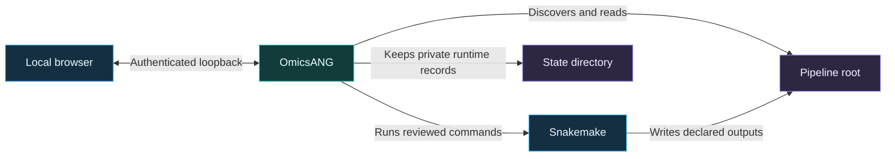
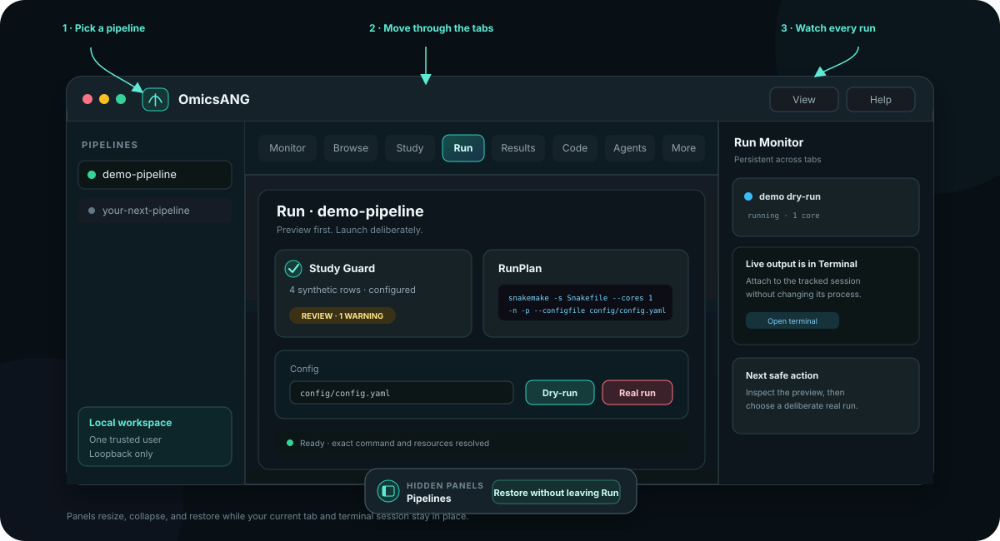

<!--
SPDX-FileCopyrightText: 2026 Anil Kumar Challagandla
SPDX-License-Identifier: PolyForm-Noncommercial-1.0.0
-->

# OmicsANG beginner tutorial

Go from a clean Linux environment to a reviewed dry-run, a real synthetic run,
and an inspected result. No real biological sequences or participant data are
used anywhere in this tutorial.


> **Time:** about 20 minutes<br>
> **Level:** no OmicsANG experience required<br>
> **Outcome:** one synthetic result table produced through the same guarded flow
> you will use for a real pipeline

## What you will do

1. Install OmicsANG in an isolated Python environment.
2. Install Snakemake separately as the demo's workflow engine.
3. Copy the bundled synthetic pipeline into a clean workspace.
4. Verify the fixture with a command-line dry-run.
5. Launch OmicsANG in the foreground on loopback.
6. Configure the run, inspect Study Guard, and run a locked dry-run.
7. Approve one real synthetic run and inspect its result.
8. Stop OmicsANG cleanly and learn how to relaunch it.

## Before you begin

OmicsANG currently supports Linux with Python 3.10 through 3.13. Windows users
should work inside a current WSL Linux distribution. Native Windows and macOS
launches are not supported by this release.

You need:

- Python 3.10–3.13 with `venv` and `pip`;
- a current JavaScript-enabled browser on the same machine;
- this source checkout or an extracted source release archive;
- enough permission to create directories under your home directory.

Check the basics:

```bash
python3 --version
git --version
```

Git is needed only when cloning the repository. If you downloaded and extracted
a source archive, start in that extracted directory instead.

> [!IMPORTANT]
> OmicsANG is a local control surface, not a sandbox. Pipelines, terminals, and
> agents run with your operating-system account's permissions. Use trusted
> pipeline repositories and review every real run.

## 1. Get the source

Clone the repository:

```bash
git clone https://github.com/challagandla/OmicsANG.git
cd OmicsANG
```

If you downloaded a release archive, extract it and enter the extracted
directory instead. Keep the source directory until the tutorial is finished:
the synthetic demo is included in the source distribution, not in the wheel.

Confirm that you are in the right place:

```bash
ls -l pyproject.toml examples/demo-pipeline/Snakefile
```

Both files should be listed. A `No such file` message means you are not in the
repository's top-level directory.

## 2. Install OmicsANG

Create a dedicated virtual environment. This keeps OmicsANG separate from your
system Python and from any legacy `benchtop` distribution:

```bash
python3 -m venv "$HOME/.venvs/omicsang"
. "$HOME/.venvs/omicsang/bin/activate"
python -m pip install --upgrade pip
python -m pip install .
omicsang --version
```

The final command should print an OmicsANG version. Keep this environment
activated for the rest of the tutorial.

### Install the demo's workflow engine

OmicsANG deliberately does not bundle Snakemake or other workflow engines. For
this isolated tutorial environment, install Snakemake separately:

```bash
python -m pip install snakemake
snakemake --version
```

If your organization manages Snakemake through Conda, Mamba, Micromamba, a
module system, or a pipeline-specific environment, use that supported method
instead. What matters is that both of these commands succeed in the terminal
from which you will launch OmicsANG:

```bash
omicsang --version
snakemake --version
```

Graphviz is optional for this tutorial. Install its `dot` command later if you
want OmicsANG to render DAG images.

<details>
<summary><strong>Conda/Mamba installation alternative</strong></summary>

The included environment file installs OmicsANG, but intentionally does not
install Snakemake. Create the environment, then add Snakemake using the same
environment manager:

```bash
mamba env create --file environment.yml
mamba install --name omicsang --override-channels \
  --channel conda-forge --channel bioconda snakemake
mamba run --name omicsang omicsang --version
mamba run --name omicsang snakemake --version
```

Replace `mamba` consistently with `conda` or `micromamba` if that is the tool
you use. Run only one installation path.

</details>

## 3. Understand the three directories

The tutorial keeps software, pipeline files, and private runtime state separate:

```text
OmicsANG/                              source checkout
├── pyproject.toml
└── examples/demo-pipeline/            bundled source fixture

$HOME/omicsang-workspace/              pipeline root shown in the sidebar
└── demo-pipeline/
    ├── Snakefile
    ├── config/config.yaml
    └── data/samples.tsv

$HOME/.local/state/omicsang-demo/       private logs, history, backups, and state
```

The `--root` value must be the directory **containing** pipeline directories.
Do not point it directly at `demo-pipeline`. Keep the state directory outside
the pipeline root.



## 4. Stage the synthetic pipeline

Create the workspace and copy the fixture:

```bash
export OMICSANG_TUTORIAL_ROOT="$HOME/omicsang-workspace"
export OMICSANG_TUTORIAL_STATE="$HOME/.local/state/omicsang-demo"
mkdir -p "$OMICSANG_TUTORIAL_ROOT"
if [ -e "$OMICSANG_TUTORIAL_ROOT/demo-pipeline" ]; then
  printf '%s\n' 'Stop: demo-pipeline already exists; choose a fresh root and state.'
else
  cp -R examples/demo-pipeline "$OMICSANG_TUTORIAL_ROOT/"
fi
```

Use a fresh root and state pair when repeating the tutorial. Reusing an old
copy may leave `results/synthetic-summary.tsv` in place, causing Snakemake to
correctly report that there is nothing to do instead of running both demo jobs.

Verify the copied layout:

```bash
find "$OMICSANG_TUTORIAL_ROOT/demo-pipeline" -maxdepth 2 -type f -print
```

You should see these three files:

```text
Snakefile
config/config.yaml
data/samples.tsv
```

The sample sheet has four invented rows: two controls and two treated samples.
The `synthetic_value` column is only a small integer used to calculate a mean.

## 5. Prove the fixture can dry-run

Run Snakemake directly once before opening the UI:

```bash
(
  cd "$OMICSANG_TUTORIAL_ROOT/demo-pipeline"
  snakemake \
    --snakefile Snakefile \
    --configfile config/config.yaml \
    --cores 1 \
    --dry-run \
    --printshellcmds
)
```

Expected ending:

```text
This was a dry-run (flag -n).
```

A dry-run evaluates the workflow and plans jobs, but does not create the result.
If `snakemake` is not found, return to the workflow-engine installation step
before continuing.

## 6. Launch OmicsANG

Start OmicsANG in the foreground:

```bash
omicsang \
  --root "$OMICSANG_TUTORIAL_ROOT" \
  --state "$OMICSANG_TUTORIAL_STATE" \
  --host 127.0.0.1 \
  --port 8787
```

Keep this terminal open. Do not add `&`, `nohup`, or a service wrapper for the
tutorial. OmicsANG remains attached to the terminal, and you will stop it later
with `Ctrl-C`.

OmicsANG normally opens your browser with a one-time launch URL. Use the newly
opened tab. The URL fragment is consumed locally and removed from the address
bar before the main application loads.

If no browser opens, stop OmicsANG with `Ctrl-C` and relaunch from an interactive
terminal with `--no-browser` added:

```bash
omicsang \
  --root "$OMICSANG_TUTORIAL_ROOT" \
  --state "$OMICSANG_TUTORIAL_STATE" \
  --host 127.0.0.1 \
  --port 8787 \
  --no-browser
```

Copy the newest complete one-time URL from that terminal into a browser on the
same machine. Do not share, record, or screenshot the URL. Opening only
`http://127.0.0.1:8787` before the one-time exchange will not authenticate you.

## 7. Learn the workspace



The illustration is a map, not a screenshot. Your browser width and installed
tools may change the exact arrangement.

| Area | What it is for |
|---|---|
| **Pipelines** | Direct children discovered beneath your `--root` directory. |
| **Run** | Configure a typed launch, preview its exact command, and resolve a RunPlan. |
| **Study** | Inspect the configured sample table, replication, groups, batches, and design findings. |
| **Terminal** | Follow the dry-run or real run without losing its live session. |
| **Run Monitor** | Track active, queued, or orphaned jobs, live terminals, and recent failures across tabs. |
| **Results** | Browse recognized tables, figures, QC outputs, logs, and reports. |
| **Capsules** | Compare recorded run context, study identity, and output evidence. |

Panels can be resized or hidden. When a panel is hidden, the floating **Hidden
panels** dock restores it without changing the current tab or terminal session.

## 8. Configure the demo run

Configure **Run before Study** so the intended config is explicit throughout
the walkthrough. OmicsANG can auto-select the demo's first config, but making
the selection yourself removes ambiguity before the audit.

1. Select **demo-pipeline** in the Pipelines sidebar.
2. Open **Run**.
3. Choose `config/config.yaml` as the config.
4. Leave **Target** blank.
5. Set **Cores** to `1`.
6. Keep **dry-run (-n)** enabled.
7. Clear **--use-conda** for this self-contained fixture.
8. Wait for the command preview and RunPlan status to refresh.

At this point the preview should contain `--cores 1`, `-n`, and `-p`, and should
not contain `--use-conda`.

> [!TIP]
> OmicsANG may show a driver environment containing Snakemake. That environment
> can remain selected; **--use-conda** controls Snakemake's per-rule Conda mode,
> which this fixture does not need.

## 9. Review Study Guard

1. Open **Study**.
2. Select `data/samples.tsv` if it is not already selected.
3. Confirm that it is labelled as configured for Run.
4. Review every finding.
5. Choose **Use audited study**.

Expected audit for the bundled fixture:

| Check | Expected value |
|---|---|
| Rows | 4 |
| Groups | control and treated |
| Biological units | 4 |
| Design rank | 2/2 |
| Blocking findings | 0 |
| Warning | Low biological replication: two samples per group |

The expected gate is **Review**, not a perfect score. The warning is deliberate:
two samples per group are enough for a tiny software fixture, but not a blanket
recommendation for a biological study.

## 10. Run the locked dry-run

1. Return to **Run**.
2. Confirm the config, cores, dry-run flag, and command preview again.
3. Confirm that the Study Guard card refers to the audited table.
4. Choose **Dry-run**.
5. Read the locked-plan confirmation and approve it only if it still matches.

OmicsANG opens **Terminal** automatically. Follow the output until Snakemake
reports:

```text
This was a dry-run (flag -n).
```

You have now exercised pipeline discovery, configuration selection, Study
Guard, command construction, RunPlan locking, the local run queue, and terminal
reattachment without writing the declared result.

## 11. Produce the synthetic result

This next step writes one small TSV file inside the copied demo pipeline.

1. Return to **Run**.
2. Turn **dry-run (-n)** off so the displayed preview matches your intent.
3. Keep **--use-conda** off and **Cores** at `1`.
4. Confirm that the command preview no longer contains `-n` or `--dry-run`.
5. Choose the red **Real run** action.
6. Read the `REAL RUN` confirmation and approve only this synthetic fixture.
7. Follow the terminal until both planned steps complete.

Expected completion:

```text
2 of 2 steps (100%) done
```

## 12. Inspect and verify the result

Open **Results** and choose **Refresh** if necessary. Select the **Tables** filter
or search for:

```text
synthetic-summary.tsv
```

Open `results/synthetic-summary.tsv`. It should contain:

| condition | sample_count | mean_synthetic_value |
|---|---:|---:|
| control | 2 | 11.0 |
| treated | 2 | 19.0 |

You can also find the file in **Browse** under `results/`. Open **Capsules** to
compare the dry-run and real-run records and review their captured evidence.

### Optional command-line verification

In a second terminal:

```bash
cat "$OMICSANG_TUTORIAL_ROOT/demo-pipeline/results/synthetic-summary.tsv"
```

The browser view and command-line output should agree.

## 13. Stop and relaunch safely

Before stopping OmicsANG, cancel or finish any live child job visible in Run
Monitor or Terminal. Then return to the terminal that launched OmicsANG and
press:

```text
Ctrl-C
```

This stops the server but preserves the pipeline workspace and OmicsANG state.
Relaunch later with the same command:

```bash
. "$HOME/.venvs/omicsang/bin/activate"
omicsang \
  --root "$HOME/omicsang-workspace" \
  --state "$HOME/.local/state/omicsang-demo" \
  --host 127.0.0.1 \
  --port 8787
```

Use the newly opened browser tab. A restart invalidates the old browser session
and creates a new one-time launch URL.

## 14. Bring your own pipeline

When you are comfortable with the synthetic fixture, add a trusted pipeline as
another direct child of a dedicated root:

```text
$HOME/my-omics-workspace/
├── demo-pipeline/
├── rnaseq-project/
│   ├── workflow/Snakefile
│   ├── config/config.yaml
│   └── samples.tsv
└── atacseq-project/
    ├── Snakefile
    └── config/config.yaml
```

Use this checklist before a real biological run:

- [ ] The repository and workflow code are trusted.
- [ ] The selected config is the intended config.
- [ ] Study Guard is inspecting the table referenced by that config.
- [ ] Sample identity, grouping, replication, pairing, batches, and contrasts are correct.
- [ ] The exact command and RunPlan point to the intended environment and resources.
- [ ] A dry-run succeeds.
- [ ] Output, log, temporary, and reference paths are understood.
- [ ] Sensitive data stays within its approved storage and network boundary.
- [ ] The real-run confirmation still matches the reviewed plan.

Do not treat a green interface as proof that a scientific design is valid. The
operator remains responsible for the pipeline, study, inputs, environment,
resources, and interpretation.

## Troubleshooting

| Symptom | What to check |
|---|---|
| No pipeline appears | `--root` must be the parent containing `demo-pipeline`, and the demo must contain `Snakefile`. |
| `snakemake` is not found | OmicsANG and `bootstrap.sh` do not install workflow engines. Activate the environment where both `omicsang --version` and `snakemake --version` work. |
| Browser says unauthorized | Close old tabs, relaunch OmicsANG, and use the newest browser tab or newest complete one-time URL. |
| Port 8787 is in use | Stop the exact older OmicsANG process, or temporarily use `--port 8788`. Avoid broad process-kill commands. |
| State belongs to another root | Reuse the original root, or choose a different external `--state` directory. Never merge state databases. |
| `--no-browser` refuses to start | It requires an interactive controlling terminal by design; do not run it through `nohup`, redirected output, or a background service. |
| A panel disappeared | Use the floating **Hidden panels** dock to restore Pipelines, Monitor, Files, Assistant, or Terminal without leaving the current tab. |
| DAG rendering fails | Install Graphviz and check `dot -V`. Some job DAGs also need their configured inputs. |
| Native Windows or macOS launch fails | Use Linux; on Windows, run inside WSL. Native macOS is not supported in this release. |
| Non-loopback host is rejected | This is intentional. OmicsANG must not be exposed through a network, proxy, tunnel, or shared host. |

## Optional cleanup

Stopping or uninstalling OmicsANG does not delete pipeline files or state. If
you intentionally want to erase the tutorial state, first inspect the path,
then run:

```bash
omicsang \
  --root "$HOME/omicsang-workspace" \
  --state "$HOME/.local/state/omicsang-demo" \
  --clear-state \
  --yes
```

This deletes OmicsANG-managed tutorial state, not the pipeline workspace. Delete
the copied `demo-pipeline` separately only after you have reviewed its location.

## You are done

You have completed the full beginner path:

```text
install → stage → configure → audit → dry-run → real run → inspect → stop
```

Next, read the main [README](../README.md) for the complete trust boundary,
optional tools, navigation, agents, retention, upgrade, security, and licensing
details. Keep [SECURITY.md](../SECURITY.md) nearby before using confidential
repositories or data.
